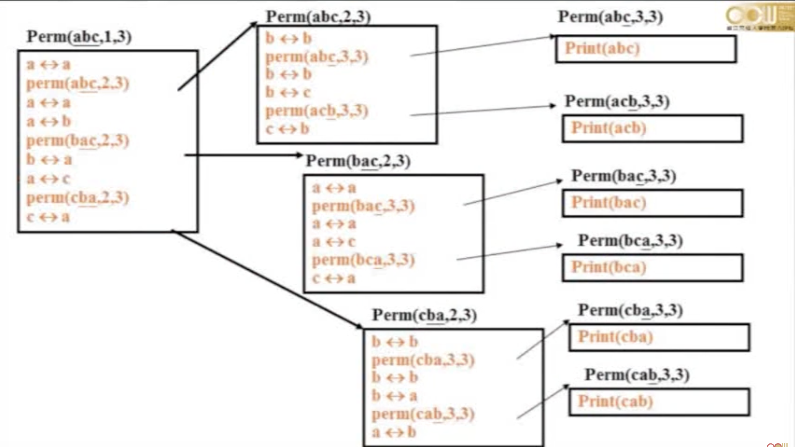
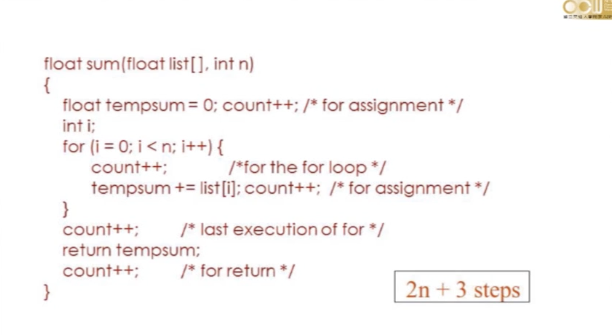
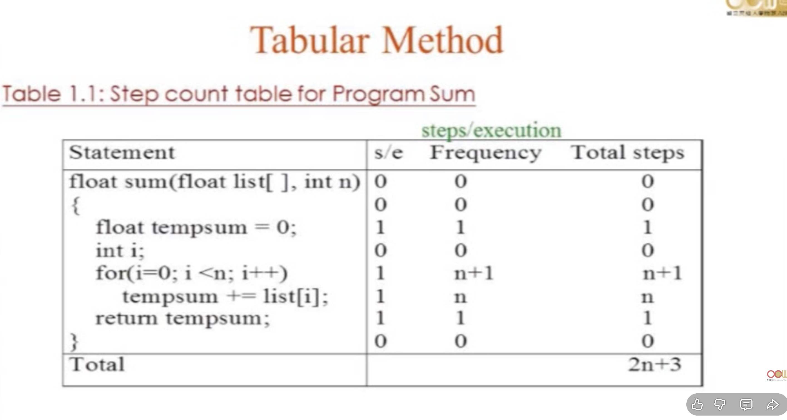

+++
title = "資料結構 02"
description = "交大資訊工程學系 彭文志老師 資料結構課程筆記"
date = 2026-02-25 04:00:00
author = "Rhan0"
tags=["algorithm"]
weight= 1
+++

## Algorithms 和 Data Structure 的關係

> Algorithm → Pseudocode → Program

Data Structure 的角色？透過程式語言實作 Pseudocode，為演算法提供資料的組織方式。

---

## Recursive Algorithms

在 [資料結構 01](/post/algorithm-01/) 中，我們介紹了 Binary Search 的迴圈寫法：

```javascript
// Time Complexity: O(log n)
// Space Complexity: O(1)
function binarySearch(arr, target) {
  let left = 0;
  let right = arr.length - 1;
  while (left <= right) {
    const mid = Math.floor((left + right) / 2);
    if (arr[mid] === target) {
      return mid;
    } else if (arr[mid] < target) {
      left = mid + 1;
    } else {
      right = mid - 1;
    }
  }
  return -1;
}
```

### Recursive Binary Search

同樣的邏輯，改用遞迴寫法：

```javascript
// Time Complexity: O(log n)
// Space Complexity: O(log n) — 遞迴 call stack 深度
function binarySearch(arr, target, left = 0, right = arr.length - 1) {
  if (left > right) return -1;
  const mid = Math.floor((left + right) / 2);
  if (arr[mid] === target) return mid;
  if (arr[mid] < target) return binarySearch(arr, target, mid + 1, right);
  return binarySearch(arr, target, left, mid - 1);
}
```

---

## Recursive Permutation（遞迴排列）

Permutation 就是排列。例如 `[a, b, c]` 的所有排列有 `3! = 6` 種：

| 固定第一位 | 剩餘排列 | 結果 |
|-----------|---------|------|
| a | Perm(b, c) | [a,b,c]、[a,c,b] |
| b | Perm(a, c) | [b,a,c]、[b,c,a] |
| c | Perm(a, b) | [c,a,b]、[c,b,a] |

**核心思路：** 固定住一個位元，對剩下的位元遞迴排列。



```javascript
function perm(arr, i, n) {
  if (i === n) {
    console.log(arr);
    return;
  }
  for (let j = i; j <= n; j++) {
    [arr[i], arr[j]] = [arr[j], arr[i]]; // 交換
    perm(arr, i + 1, n);                  // 遞迴
    [arr[i], arr[j]] = [arr[j], arr[i]]; // 還原（backtrack）
  }
}
```

> 💡 是否有其他不用 recursive 的解法？

---

## Performance Evaluation（效能評估）

當我們發現問題 → 提出想法設計 solution → 實作程式後，下一步就是進行**評估 solution 的效能**

評估方式分為兩種：

| 類型 | 說明 |
|------|------|
| **Performance Analysis** | Machine independent（不依賴硬體） |
| **Performance Measurement** | Machine dependent（依賴硬體） |

### Performance Analysis

- **Complexity Theory（複雜度理論）**
  - **Space Complexity：** 程式使用的記憶體量
  - **Time Complexity：** 程式執行的時間量

### Space Complexity

```
S(P) = C + Sₚ(I)
```

- **C：** constant，程式本身需要的固定儲存空間
- **Sₚ(I)：** 隨 input 資料量和大小變化的空間

實務上通常簡寫為 `S(P) = Sₚ(I)`，因為我們只關心隨 input 增長的部分。

### Time Complexity

```
T(P) = C + Tₚ(I)
```

- **C：** compile time，程式編譯所需時間
- **Tₚ(I)：** 隨 input 資料量和大小變化的執行時間

實務上通常簡寫為 `T(P) = Tₚ(I)`。

---

## Program Step 計算的方法

**方法 1：count++**

在每個步驟加上計數器，實際跑一次看執行了幾步。



**方法 2：畫表格**

把每一行程式的執行次數列成表格，加總起來。



---

## Asymptotic Notation（漸進符號）

上面的方法太麻煩了，所以我們用漸進符號來描述複雜度的「成長趨勢」。

> **數學符號：**
> - `iff` = if and only if（若且唯若）
> - `∃` = there exists（存在）
> - `∋` = such that（使得）
> - `∀` = for all（對所有）

### Big O — 上界（Upper Bound）

`f(n) = O(g(n))` iff

> ∃ positive constants c and n₀ ∋ f(n) **≤** c·g(n), ∀ n ≥ n₀

**白話：** 當 n 夠大之後，f(n) 永遠被 c·g(n) 壓在下面。

**範例：**

| 式子 | 展開 | c | n₀ |
|------|------|---|---|
| `3n+2 = O(n)` | 3n+2 ≤ 4n, ∀ n ≥ 2 | 4 | 2 |
| `3n+2 = O(n²)` | 3n+2 ≤ n², ∀ n ≥ 4 | 1 | 4 |

> 💡 g(n) 是 f(n) 的上界，要找**最小的**才有意義。

### Omega Ω — 下界（Lower Bound）

`f(n) = Ω(g(n))` iff

> ∃ positive constants c and n₀ ∋ f(n) **≥** c·g(n), ∀ n ≥ n₀

**白話：** 當 n 夠大之後，f(n) 永遠在 c·g(n) 之上。

**範例：**

| 式子 | 展開 | c | n₀ |
|------|------|---|---|
| `3n+3 = Ω(n)` | 3n+3 ≥ 3n, ∀ n ≥ 1 | 3 | 1 |
| `3n+3 = Ω(1)` | 3n+3 ≥ 3, ∀ n ≥ 1 | 3 | 1 |

> 💡 g(n) 是 f(n) 的下界，要找**最大的**才有意義。

### Theta Θ — 緊界（Tight Bound）

`f(n) = Θ(g(n))` iff

> ∃ positive constants c₁, c₂ and n₀ ∋ c₁·g(n) **≤** f(n) **≤** c₂·g(n), ∀ n ≥ n₀

**白話：** f(n) 被 g(n) 的兩個倍數**夾在中間**，上下界都是同一個 g(n)。

**範例：**

| 式子 | 展開 | c₁ | c₂ | n₀ |
|------|------|---|---|---|
| `3n+2 = Θ(n)` | 3n ≤ 3n+2 ≤ 4n, ∀ n ≥ 2 | 3 | 4 | 2 |

> 💡 Θ 同時是 upper bound 和 lower bound，是最精確的描述。

---

## 參考資料

- [Lec02 資料結構 第二週課程](https://www.youtube.com/watch?v=0J2eLvkuF8k)