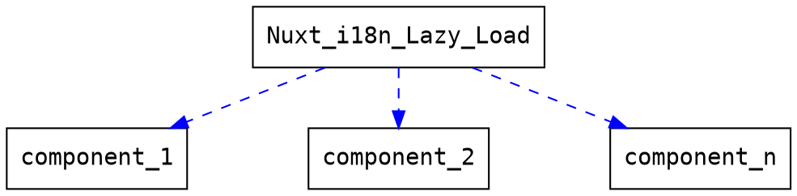

+++
title = "Nuxt i18n 優化"
description = ""
date = 2020-08-31 22:00:00
author = "Rhan0"
tags=["i18n", "nuxt"]
weight= 2
+++

## intro Nuxt i18n
### install
```
$ npm install nuxt-i18n
```
### Example
```javascript
// nuxt.config.js
{
  modules: [
    'nuxt-i18n'
  ],

  i18n: {
    locales: ['en', 'zh'],
    defaultLocale: 'en',
    vueI18n: {
      fallbackLocale: 'en',
      messages: {
        en: {
          welcome: 'Welcome'
        },
        zh: {
          welcome: '歡迎'
        }
      }
    }
  }
}
```
```html
<template>
  <main>
    <h1>{{ $t('greeting') }}</h1>
    <nuxt-link
      v-if="$i18n.locale !== 'en'"
      :to="switchLocalePath('en')"
    >
      English
    </nuxt-link>
     <nuxt-link
      v-if="$i18n.locale !== 'zh_TW'"
      :to="switchLocalePath('zh_TW')"
    >
      繁體中文
    </nuxt-link>
  </main>
</template>
```

### Set Locale

```typescript
// plugins/i18n.ts
import { Context } from '@nuxt/types'
import VueI18n from 'vue-i18n'

let vueI18n: VueI18n | null = null

export default function({ app, route }: Context): Promise<void> {
  vueI18n = app.i18n
  const LANG = (route.query.lang || 'zh_TW') as string
  return app.i18n.setLocale(LANG)
}
```

### Lazy load

把 json 或是 i18n 的 key 全部放到另外的檔案裡面去，然後再定義什麼樣的情況下要 load 這隻檔案，nuxt-i18n就會幫你把整個東西變成是 lazy loading

```javascript
// nuxt.config.js
{
  i18n: {
    locales: [
      { code: 'en', file: 'lang_en.js' },
      { code: 'zh_TW', file: 'lang_zh_TW.js' }
    ],
    lazy: true,
    langDir: 'lang/',
  }
}
```
```javascript
// lang/en-US.js
export default(context) => {
  return new Promise(function (resolve) {
    resolve({
      welcome: 'Welcome'
    })
  })
}
```

## Async Components

因為每個頁面並不需要使用到所有的 module，甚至某些情境下，英語系才有的 module，在中文語系下並不需要，因此可以利用 Async Components 來優化效能，針對當前語系的需要 load 對應的 module 就好，不用全部載下來。

```javascript
const AsyncWeather: Function = () =>({
  component: import(
    '~/components/weather/Weather.vue'
  ),
  delay: 0,
  timeout: 3000
})

export default AsyncWeather
```

## i18n Setup
nuxt-i18n 的 lazy load 會幫我們把所有的 message 載回來後，透過 async components 去對應到相對應的 module，每一個 module 就會有語系的資料


## Problem 1: page speed
為什麼使用了 nuxt-i18n 之後，導致速度變慢？


如圖，可以看到語系檔的載入消耗了非常多時間

### Split message
將語系檔案拆分，並按照對應的 module 在需要時才做第一次的 import
> 建議每個語系檔內小於 100 筆資料

結構：
```
-| i18n/
---| modules/
------| wheather/
---------| wheather_en.json/
---------| wheather_zh_TW.json/
------| xxx/
---| shared/
---| sources/
```
### 優化 nuxt-i18n 的 lazy laod
一開始 lazy load 負責把所有的 message 載入後，透過 component 把他分配到裡面去(如下圖)

#### 改成
一開始 lazy load 負責把"需要的"的 message 載入後，再到對應的 component 去分別分裝好(如下圖)


### Solution
nuxt component 吃的參數其實是一個 Promise，因此可以在最外層利用 Promise.all，將第一個部分也就是 component 進行載入，再把 module message 載入進來，等兩個都載入完成後，才會確定這個 component 已經準備好了，可以讓我們的 code 更乾淨，如此一來可以把 i18n 的邏輯跟 component 本身的邏輯拆開

```javascript
import { i18nModuleType, importModuleMessage } from '~/plugins/i18n'

const AsyncWheather: Function = () => ({
  /**
   * Dynamic & Async Components
   * https://vuejs.org/v2/guide/components-dynamic-async.html
   */
  component: Promise.all([
    import(
      '~/components/wheather/Wheather.vue'
    ),
    importModuleMessage(i18nModuleType.article)
  ]).then(([component]) => component),
  delay: 0,
  timeout: 3000
})

export default AsyncWheather

```

## Problem 2: SSR
一開始是英文，一秒後變成中文的原因？
此情況是在第二次 request 才會壞掉，第一次 request 是正常的，原因是在處理 async component 時會認為這個東西我沒有見過，所以會幫 Promise.all() 裡面的東西全部做完，做完後，導致 HTML 裡面會有 message，第二次 request 時，他認為 async component 剛剛已經處理過了，所以會省略 Promise.all() 直接 return component，這時候 HTML 就沒有 message，到 Client side 的時候才會把 message 載入，導致此情形

### Solution
解法：在 server side 的時候，一次把所有 message 載入完畢，在 client side 時才依照需要去載入對應的 message


## Problem 3: webpack compile
* 第一種方式，照著 Nuxt 官網建議，把 lazy load 的檔案用 export default Obj 的方式(JS literal)，而因為 ``Object`` 有 key, value，打包時 webpack 認定此為``Object``，就會直接放到 compile 檔案裡面去，如下圖


* 第二種方式，用 ``JSON.stringify()`` 產生 JSON，再用 ``JSON.parse()`` 回結果(Object)，
    
    > #### JSON.parse 速度快於 JS literal parse 速度([google v8 官方 Blog 的背書](https://v8.dev/blog/cost-of-javascript-2019#json))
### before and after


### Solution
#### 目標：將 webpack 打包後的結果，改成 compile ``JSON.parse(String)``，而不是一開始就 compile Object

因此必須要將被打包的檔案內容調整為 ``JSON.parse(String)``
在需要``JSON.parse()`` 的前提下，如果只有執行一次 ``JSON.stringify(JSON)`` ，會變成``JSON.parse(Object)`` 因此而報錯
```javascript
export default JSON.parse(JSON.stringify(origin))
// Uncaught SyntaxError: Unexpected token o in JSON at position 1
```
而如果把``JSON.parse()``移除的話會成功，但又回歸到 export default Object 了不是我們要達到的目的
```javascript
export default JSON.stringify(origin)
/**
 * 等同於
 * export default {
 *   'xxx': 'xxx'
 * }
 */ 
```
#### 解法：
執行兩次 ``JSON.stringify()``
```javascript
export default JSON.parse(
    JSON.stringify(
        JSON.stringify(origin)
    )
)
```

* 1次


* 2次


## Summary
1. Split big JSON into small pieces.
2. Only import the messages the you need.
3. Server side: import the whole messages.
4. Client side: import messages on the fly.
5. Don’t use JS literal to save i18n message. Use JSON.

## 參考
1. LINE engineering https://engineering.linecorp.com/zh-hant/blog/vue-taiwan-006-sharing/?fbclid=IwAR0XzDN0hOPyqG_aPuNjnKKs171EIXMtAs8--kAiAQcKW5uTrdoez_VBK30
2. google v8 官方 Blog https://v8.dev/blog/cost-of-javascript-2019#json 
3. nuxt lazy load https://i18n.nuxtjs.org/lazy-load-translations/ 
4. JSON.stringify() / JSON.parse() https://developer.mozilla.org/zh-TW/docs/Web/JavaScript/Reference/Global_Objects/JSON/stringify
5. nuxt-i18n https://i18n.nuxtjs.org/
6. vue Dynamic & Async Components
 https://vuejs.org/v2/guide/components-dynamic-async.html